# ML 定义

在机器学习的历史上，一共出现了两种定义。

1956 年，开发了西洋跳棋 AI 程序的 Arthur Samuel 在标志着人工智能学科诞生的达特茅斯会议上定义了 “机器学习” 这个词，定义为，“在没有明确设置的情况下，使计算机具有学习能力的研究领域”。

:question:If the checkers program(跳棋程序) had been allowed to play only ten games (instead of tens of thousands) against itself, **a much smaller number of games**, how would this have affected its performance?
× Would have made it better
√ Would have made it worse

启示：一般情况下，学习的机会越多，算法的表现越好。

1997 年，Tom Mitchell 提供了一个更现代的定义：“如果用 P 来测量程序在任务 T 中性能。若一个程序通过利用经验 E 在 T 任务中获得了性能改善，则我们就说关于任务 T 和 性能测量 P ，该程序对经验 E 进行了学习。”

例如：玩跳棋。

E = 玩很多盘跳棋游戏的经验

T = 玩跳棋的任务。

P = 程序将赢得下一场比赛的概率。

# 分类

一般来说，任何机器学习问题都可以分配到两大类中的一个：

有监督学习 supervised learning 和无监督学习 unsupervised learning。

简单的说，监督学习就是我们教计算机去做某件事情，无监督学习是我们让计算机自己学习。

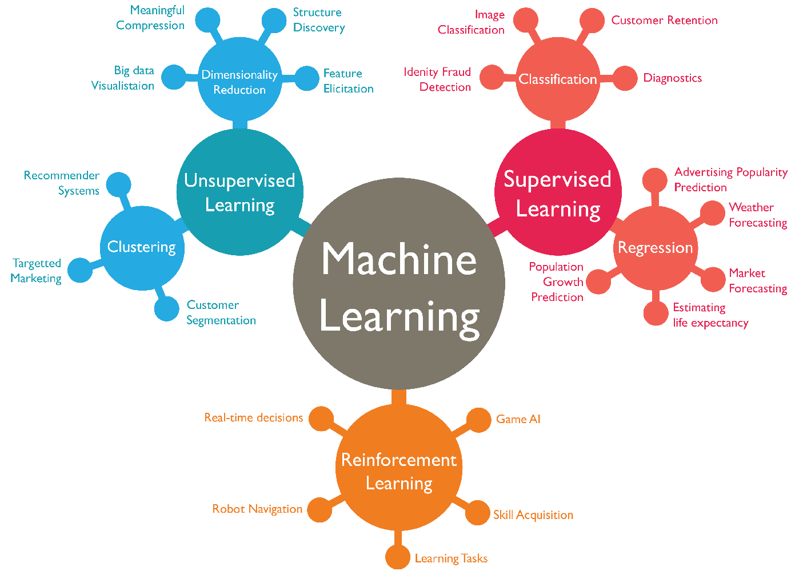

## supervised learning

“有监督学习”指的是学习从输入$x$ (一个或多个) 映射到输出 $y$ 的算法。有监督学习算法的关键在于首先要提供正确的样本示例供算法学习，然后算法便可以针对未见过的输入，输出相应的预测结果。下面是一些有监督学习的在现实生活中的示例：

- 垃圾邮件过滤器：email --> 垃圾邮件? (0/1)
- 语音识别：语音 --> 文本
- 机器翻译：英文 --> 中文
- 广告投递：广告、用户信息 --> 用户点击? (0/1)
- 自动驾驶：图片、雷达信息 --> 其他车辆位置
- 视觉检测：手机图片 --> 有缺陷? (0/1)

在监督式学习中，首先有一个数据集，并且已知正确的输出是什么，且输入和输出存在关联。 监督学习问题分为“**回归 Regression”**和“**分类 Classification**”问题。

### 回归问题示例：房价预测

  “房价预测”就是根据房子的面积计算价格。下图中的“红叉”就是预先提供的有正确映射关系的样本，“蓝色拟合线”就相当于算法学习输入样本，最后通过拟合线得到房价便是“预测”，这便是“有监督学习”的完整流程。注意到这个回归问题的输出(房价)可以是任意数字，于是便有无穷种可能。

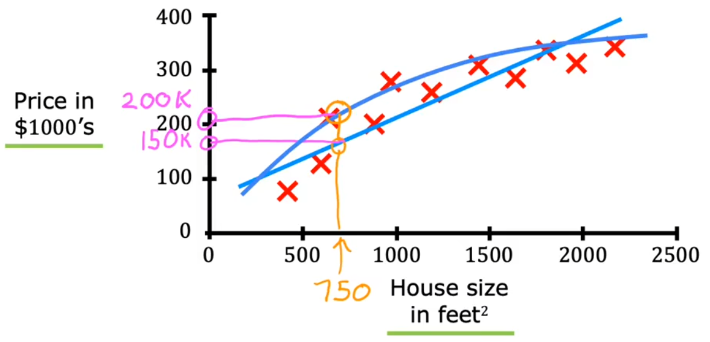

- **直线拟合：**根据拟合直线，可以预测房屋面积 $750 feet^2$   对应的价格大约为 $150k$。
- **曲线拟合**：根据拟合曲线，可以预测房屋面积 $750 feet^2$  对应的价格大约为 $200k$。

### 分类问题示例：乳腺癌检测

  乳腺癌检测问题就是根据输入的一系列信息，如肿瘤块的大小、患者年龄、肿瘤块的厚度、细胞大小的均匀性、细胞形状的均匀性等，来判断是否为恶性肿瘤( 0 表示良性/ 1 表示恶性)。下面给出“单输入的乳腺癌检测”、“两输入的乳腺癌检测”示意图：

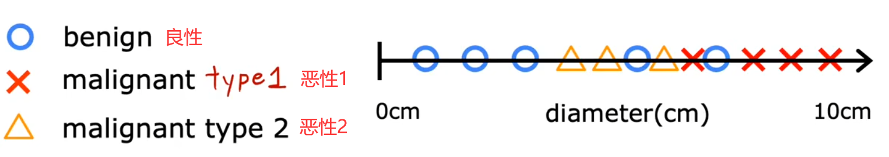

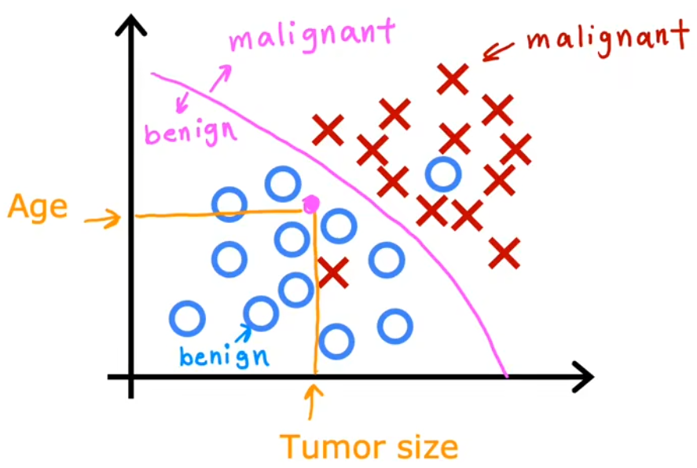

## unsupervised learning

> Data only comes with inputs $x$, but not output labels $y$. Algorithm has to find structure in the data.

在“有监督学习”之后，“无监督学习”也被广泛应用起来。“无监督学习”不是要找映射关系，而是想要从 **没有标记的数据集** 中发现一些有趣的东西，比如这个数据集中有什么 可能的模式或结构。无监督学习的主要类型有：

- **聚类(Clustering)**：将相似的数据点分成一组。
- **异常检测(Anomaly detection)**：。有非常多的应用，比如在金融系统的诈骗检测中，异常时间、异常交易可能是欺诈。
- **降维(Dimensionality reduction)**：在尽可能丢失少的信息的前提下，将大数据集压缩成小得多的数据集。

:question:Of the following examples, which would you address using an **unsupervised learning** algorithm?

- × Given email labeled as spam/not spam, learn a spam filter.
- √ Given a set of news articles found on the web, group them into sets of articles about the same story.
- √ Given a database of customer data, automatically discover market segments and group customers into different market segments.
- × Given a dataset of patients diagnosed as either having diabetes or not, learn to classify new patients as having diabetes or not.

知识点：有监督学习给数据和标签，重点在于对新输入预测出标签；无监督学习只给数据，重点在于自行分组。

### 聚类算法示例1：新闻分类

“谷歌新闻”的任务就是将每天数十万的新闻进行聚类，找到提到相似词的文章并将其分组。很酷的是，聚类算法可以自己计算出哪些词暗示了这些文章属于同一个组，并且谷歌新闻的员工也没有事先告诉算法有哪些组。如下图所示，panda、twin、zoo 都是相似的词，这些文章被归为一类。

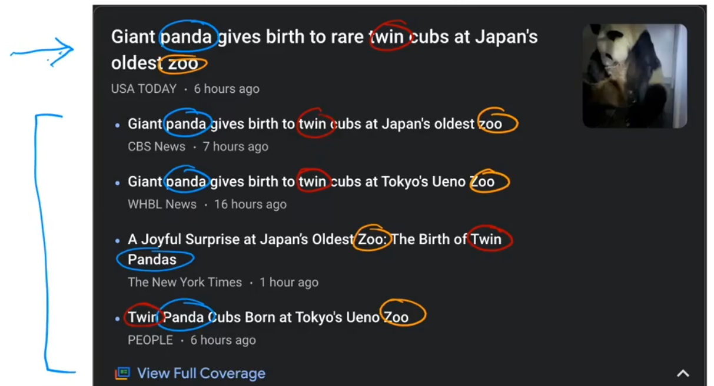

### 聚类算法示例2：基因分类

下图所示的基因图谱，每一列表示一个人的全部基因，每一行表示一种基因，不同的颜色表示该基因的活跃程度，这些基因包括瞳孔颜色、身高、不爱吃西蓝花/包菜/莴苣等。聚类算法仅根据这些基因数据，将人进行分组，进而找出“基因上很相似的人”。

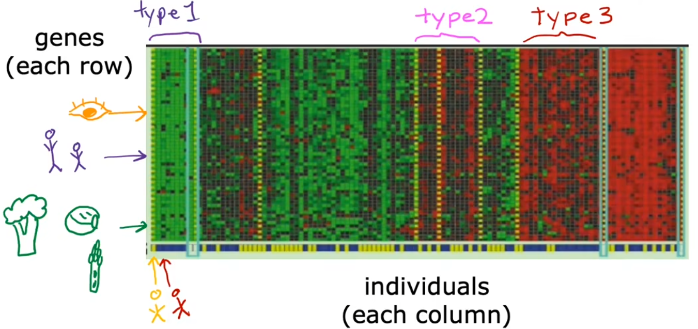

### 聚类算法示例3：客户分群

 还有一个很常见的聚类算法示例就是，根据客户信息数据库，将不同的客户划分进不同的细分市场，以便更有效的服务客户。比如深度学习团队“dot AI” 想知道 dot AI社区中的人们，参加课程、订阅通知、参加 AI 活动等的动机是什么。于是通过调研团队便发现了拥有不同动机的人，比如：提升技能、发展事业、紧随AI潮流、或者哪个都不是。这个例子中调研团队就相当于无监督学习算法。

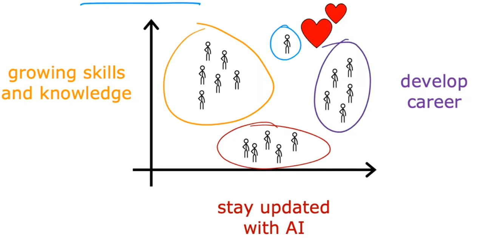

# 线性回归模型

本节将通过“线性回归模型” (Linear Regression Model) 介绍“有监督学习”的整个过程，这也是本课程的第一个模型。下面是常用的机器学习术语：

- Training Set (数据集)：用于训练模型的数据集。
- $x$：input variable (输入变量) / feature (特征) / input feature(输入特征)，也就是“特征值”。
- $y$：output variable (输出变量) / target variable (目标变量)，也就是“目标值”。
- $m$：表示训练样本的数量。
- $( x , y )$：单个训练样本。
- $( x^{(i)} , y^{(i)} )$：第 i 个训练样本。上标加括号是为了和求幂次区别开来。
- $\hat{y}$ ：表示对 y 的估计或预测。

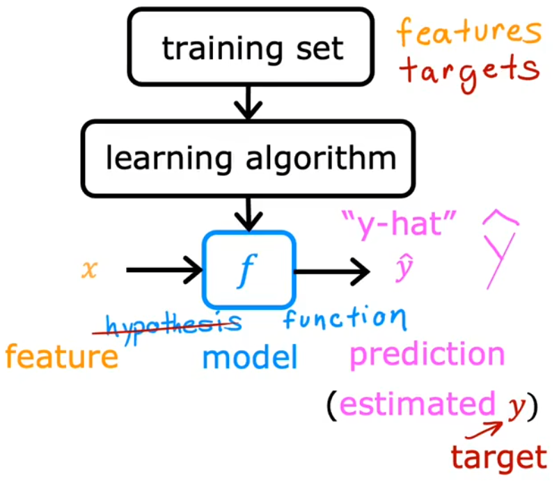

上图给出了整个“有监督学习”的流程，也就是**“learning algorithm”**根据输入的“**训练集**”得到一个**函数模型$f$**，于是便可以通过 $f$ 来对 **输入$x$** 进行预测 **输出 $\hat{y} $**。

而“线性回归模型”就是假设函数模型$f$ 为一条直线，因为简单易用，这可能是世界上使用最广泛的学习算法，后续也会在其他机器学习模型中见到线性回归模型。

“线性回归”只是解决回归问题的方法之一，其他方法会在 Course2 中会介绍。现在以上一小节“房价预测”问题举例，若使用“线性回归模型”假设 $f$ 就是一条直线，于是该模型就可以写成：
$$
f_{w,b}(x) = wx + b
$$
标识函数 $f$ 以 $x$ 为函数输入，其输出 $\hat{y}$ 取决于 $w$ 和 $b$ 的值。

- $w$、$b$ ：模型的参数 parameters
- $f_{w,b}(x) $ 通常简写为 $f(x)$

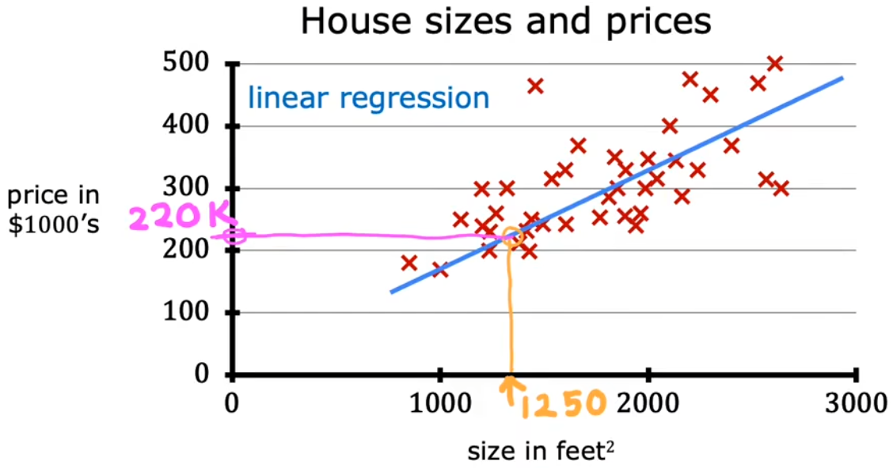

## 代价函数

显然，虽然现在已经构建好了“线性回归模型”，但是过训练集的直线有无数种，如何找出与训练数据最拟合的线还不明确，于是本节就来介绍**代价函数(cost funtion)**：在机器学习中，代价函数用于衡量模型的好坏。

最简单、最常用的代价函数是**“平均误差代价函数”(Squared error cost function)**：
$$
J(w,b) = \frac{1}{2m}\sum_{i=1}^{m}(\hat{y}^{(i)} - y^{i})^2 =  \frac{1}{2m}\sum_{i=1}^{m}(f_{w,b}(x^{i}) - y^{i})^2
$$

- $w$，$b$：模型的参数
- $i$：训练样本的标号
- $m$：训练样本的总数
- $y^{i}$：第 $i$ 的样本的真实目标值
- $\hat{y}^{(i)}$：对 $y^{(i)}$ 的目测目标值
- 除以 $2m$：按照惯例，机器学习中的平均代价函数会除以 $2m$ 而非 $m$，这是为了使后续的计算更加简洁

现在来直观的看一下，最小化代价函数如何找到与训练数据最拟合的线。

首先简化模型，设置参数 $b = 0$ ，并假设训练数据只有三个点。下图给出了不同的 $w$ 所对应不同的代价 $J(w)$，显然在 $w = 1$ 处代价最小，直线也最拟合：
$$
\min J(w)  =  \frac{1}{2m}\sum_{i=1}^{m}(f_{w,b}(x^{i}) - y^{i})^2 = \frac{1}{2m}\sum_{i=1}^{m}(wx^{(i)} - y^{i})^2
$$
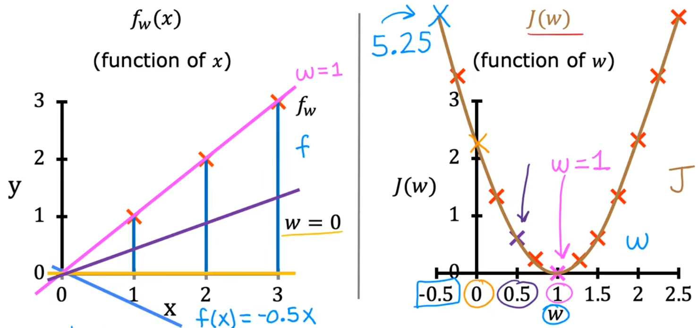

那回到刚才的问题中，同时将 $w$ 和 $b$ 都考虑在内，并引入更多的训练数据，便可以得到下面的代价函数示意图。为了更好的将代价函数可视化，同时使用“等高线图”和“3D图”来展示不同的 $w$ 和b $b$ 所对应不同的代价 $J ( w , b )$ 。“3D图”类似一个“碗”，显然在“碗”的底部，代价函数最小：

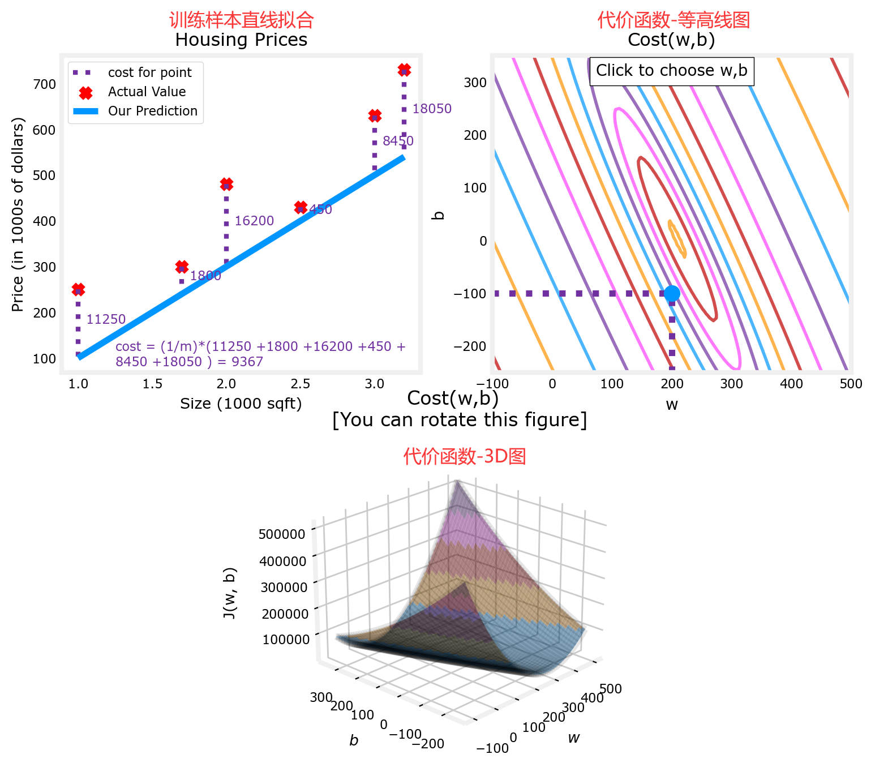

虽然现在距离完成“线性回归问题”非常接近了，但是上述是通过人眼来直观的寻找代价函数的最小点，实际上要画出有足够多细节的3D图需要计算大量的 $J ( w , b ) $，而很多$ J ( w , b ) $ 点都是没用的，这显然不划算。下一节就来介绍如何通过计算有限的  $J ( w , b ) $点来找到代价函数最小点。

# 梯度下降法

梯度下降 (Gradient Desent) 常用于寻找某函数（比如代价函数）的最大值、最小值。梯度下降不仅用于线性拟合，也用于训练如神经网络(Course2)等深度学习模型、以及一些最大型、更复杂的人工智能模型。下面以前面的 $min_{w,b} J(w,b)$ 来举例，梯度下降算法的步骤为：

- 选择初始点，一般在取值范围内选取简单的整数，如 $w = 1 , b = 0 $

- 沿着 $J$ 的“负梯度”方向，不断迭代计算 $w、b$。之所以沿着“负梯度”方向，是因为沿该方向下降速度最快(steepest descent，最速下降)。如下：

$$
w = w - α\frac{\partial}{\partial w}J(w,b)\\
b = b - α\frac{\partial}{\partial b}J(w,b)
$$

- α：学习率 (Learning rate)，用于控制步长。通常为介于 0~1 之间的一个小的正数，如 0.01
- $\frac{\partial}{\partial w}J(w,b)$：代价函数对 $w$ 的偏导数 (Partial Derivative)，其取正值表明的方向可以使 $J$ 下降
- $\frac{\partial}{\partial b}J(w,b)$：代价函数对 $b$ 的偏导数 ，同上
- 注意：上面是同时更新 (Simultaneously update)，也就是使用旧的 $(w,b)$ 直接分别计算出新的 $w、b$；而不是先更新 $w$，再使用这个新的 $w$ 计算新的 $b$。
- 直到 $w$ 和 $b$ 的负梯度都为 $0$ (或者 $0$ 的邻域内)，即可认为找到 $J$ 的最低点。

下面两张图很直观的给出了整个梯度下降法的过程。

在下图 1 中，首先固定 $b=0$，只分析 $w$ 对代价函数 $J(w)$ 的影响。可以发现，若当前 $w$ 在最低点右侧，由于“负梯度”小于 0，于是下一个 $w$ 将向左移动；反之若当前 $w$ 在最低点左侧，由于“负梯度”大于0，下一个 $w$ 将向右迭代。只要选择合适的学习率 α，最终就可以找到最低点所在的 $w$ 。

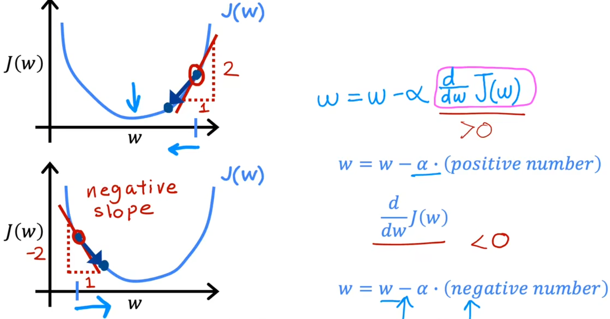

在下图 2 中，则进一步同时考虑 $w$ 和 $b$，可以发现每次也是沿着“负梯度”下降最快的方向，最终可以到达最低点所在处。这个迭代的过程就是“梯度下降”，类似于“下山”的过程。

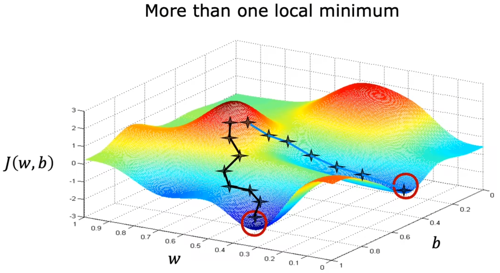

## 学习率

学习率 α 的选取将会对梯度下降的效率产生巨大影响。若 α  选取的不好，甚至会导致无法实现梯度下降。

- *α* 选取的太小，会导致下降的速度非常慢(意味着需要计算很长时间)，但最终也会收敛 (converge) 到最小值。
- *α* 选取的太大，很可能会导致在极值点附近反复横跳甚至越来越远，也就是不会收敛甚至发散(diverge)。
- *α* 选取的合适，越接近代价函数极小值，梯度越来越小，就会导致步长越来越小。

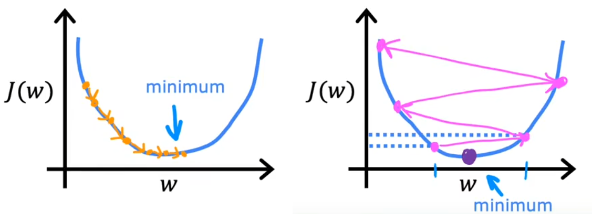

**多个极值点**

在前面的讨论中，一直使用平方误差项作为代价函数。对于平方误差项 的代价函数，都是“凸函数”或“凸面”。但若代价函数非凸时，可能就会存在不止一个极值。如上图 gd2 中，不同的起始点，就会导致不同的收敛速度或极值。所以 **代价函数尽量要选择凸函数**。

## 用于线性回归的梯度下降

介绍完梯度下降法，现在来总结一下，将前面的线性回归模型、代价函数、梯度下降算法结合起来，按照下面公式不断迭代直至其收敛：

- Linear regression model：$f_{w,b}(x) = wx + b$
- Cost function：$J(w,b) =  \frac{1}{2m}\sum_{i=1}^{m} (wx^{(i)} - y^{i})^2$
- Gradient descent repeat until covergence：（这里用了微积分的偏导数，不记得也不影响）

$$
w = w - α\frac{\partial}{\partial w}J(w,b) = w- \frac{α}{m}\sum_{i=1}^{m}[ (f_{w,b}(x^{(i)}) - y^{i})*x^{(i)}] \\ b = b - α\frac{\partial}{\partial b}J(w,b) = b- \frac{α}{m}\sum_{i=1}^{m}(f_{w,b}(x^{(i)})-y^{i}))
$$

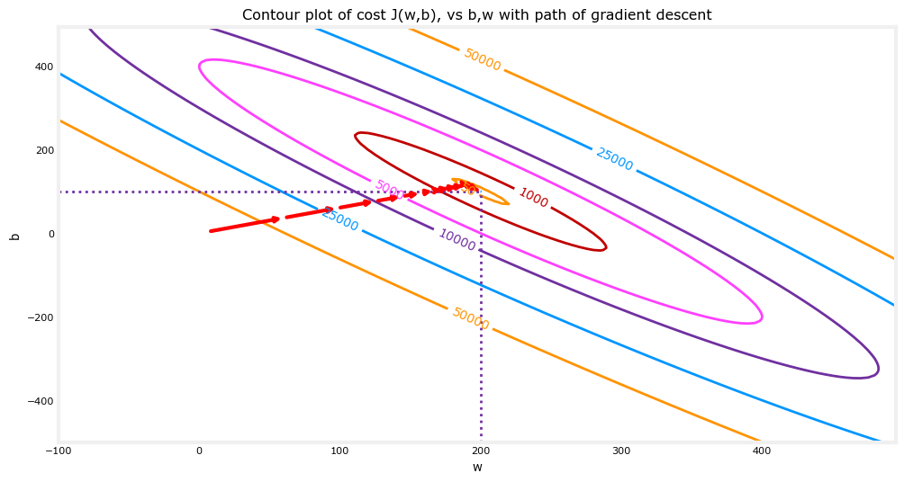

最后说明一下，由于在使用梯度下降法求解问题的过程中，**每次迭代**都会使用到**所有的训练集数据**计算代价函数及其梯度，所以这个梯度下降的过程称为“**批量梯度下降**(Batch gradient descent)”。当然本问题较为简单，在其他数据更为复杂的模型中，为了简化梯度下降法的计算量，每次只使用训练集的子集。

<EOF>
